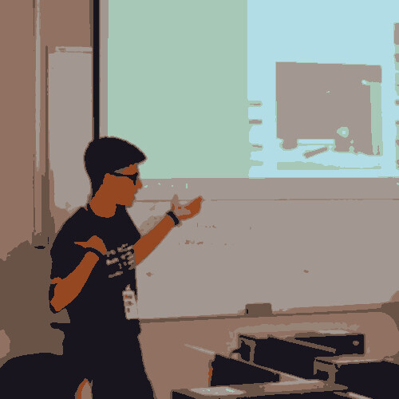
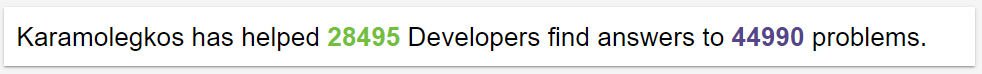

<div align="center">
  <h2> 𝐇𝐞𝐥𝐥𝐨 𝐭𝐡𝐞𝐫𝐞, 𝐟𝐞𝐥𝐥𝐨𝐰 <𝚍𝚎𝚟𝚎𝚕𝚘𝚙𝚎𝚛𝚜/>! </h2>
  
  
</div>

<div align="center">

You have finally discovered my Github profile. <br>
Please feel free to clone/fork projects, raise issues and submit PRs if you think something could be better. <br>
Ask me anything by emailing me <a href="mailto:p.karamolegos@yahoo.gr"><b>here</b></a>.

<i>Happy Coding!</i> 😊
</div>
<p align='center'>
  <!--
  
  -->
</p>
<br>

```javascript
const Karamolegkos = {
  "Name": "Panagiotis",
  "Surname": "Karamolegkos",
  "Occupation": ["IT Student @ University of Piraeus", "Developer", "Researcher"],
  "Age": 22,
  "Residence": "Greece",
  "Languages": ["Greek", "English"],
  "Hard Skills": {
    "Front-End Development": ["HTML", "CSS", "Javascript", "JQuery", "Bootstrap"],
    "Back-End Development": ["Java", "Python", "Node.js"],
    "Database Management and Development": ["Mongo", "MySQL", "SQLite", "MinIO"],
    "Android Development": ["Android Studio"],
    "Structured Data Representation": ["JSON", "XML", "DTD", "XSD", "XSL"],
    "API Development": ["RESTFul", "SOAP"],
    "Digital Clouds": ["OpenStack", "OpenStack Heat"],
    "Big Data": ["Spark", "Hadoop", "Mahout", "Flume", "Kafka", "Avro"],
    "Other": ["Docker", "UML", "jinja2", "jsp", "flask", "MATLAB", "Octave", "Arduino", "Scratch", "C", "GIT", "Image Editing", "Video Editing", "Shell Scripting", "Microsoft Office"]
  },
  "Soft Skills": [
    "Problem Solving", 
    "Public Speaking",
    "Leadership",
    "Creativity",
    "Team Spirit",
    "Adaptability",
    "Communicativeness",
    "Thinking with Mathematical Perception"
  ],
  "Hobbies": [
    "Grepper Helping",
    "General Programming and Coding",
    "Application Development",
    "Basketball"
  ]
}
```

<div align="center">
  
## I am also a purple Grepper belt 😃
  <p>
  I am using <a href="https://www.codegrepper.com/"><b>Grepper</b></a> about a year now. I like helping people and solving problems a lot 💪. <br>
  You can find my profile <a href="https://www.codegrepper.com/app/profile.php?id=46210"><b>here</b></a>.
  </p>
  <br>
  
  
</div>
<br>
<div align="center">

## 😂 Here is a random joke that'll make you laugh!

</div>

<p align='center'>
  
</p>


<!--
<p align='center'>
  
</p>
-->
<!--
**karamolegkos/karamolegkos** is a ✨ _special_ ✨ repository because its `README.md` (this file) appears on your GitHub profile.

Here are some ideas to get you started:

- 🔭 I’m currently working on ...
- 🌱 I’m currently learning ...
- 👯 I’m looking to collaborate on ...
- 🤔 I’m looking for help with ...
- 💬 Ask me about ...
- 📫 How to reach me: ...
- 😄 Pronouns: ...
- ⚡ Fun fact: ...
-->
